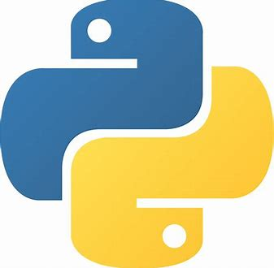
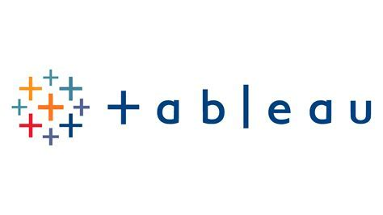

### Hi there 👋
# Welcome to my github! 👋

	

## About Me 🎓

Recent Electronics and Telecommunication Engineering graduate from Pune University with a deep-rooted passion for data analysis. My academic journey has fostered a robust technological mindset, driving my insatiable curiosity for continuous learning in the dynamic realm of data analytics. Eager to contribute my skills and enthusiasm to the evolving field, I believe there is always more to explore and discover. 🧠 Let the data-driven adventures begin! 🚀

## What I Know :Data Analysis:

- **Programming Languages:**
  - Python
  - R
  
- **Database Management:**
  - MySQL
  - MongoDB

- **Web Technologies:**
  - HTML, CSS, and Javascript :white_check_mark:

- **Data Analysis and Visualization:**
  - Power BI
  - Excel
  - Tableau
  - Project: Business Intelligence Transformation for AdventureWorks Cycles

- **Machine Learning:**
   - Skilled in machine learning techniques and algorithms.
   
- **Certification:**
  - Completed a Google Data Analytics Professional Certificate.
  - Project: Cyclic Bike-Share (as part of the certification).
   - Microsoft Power BI Desktop for Business Intelligence.
  - Project: Business Intelligence Transformation for AdventureWorks Cycles.

  
  
  
  
  

